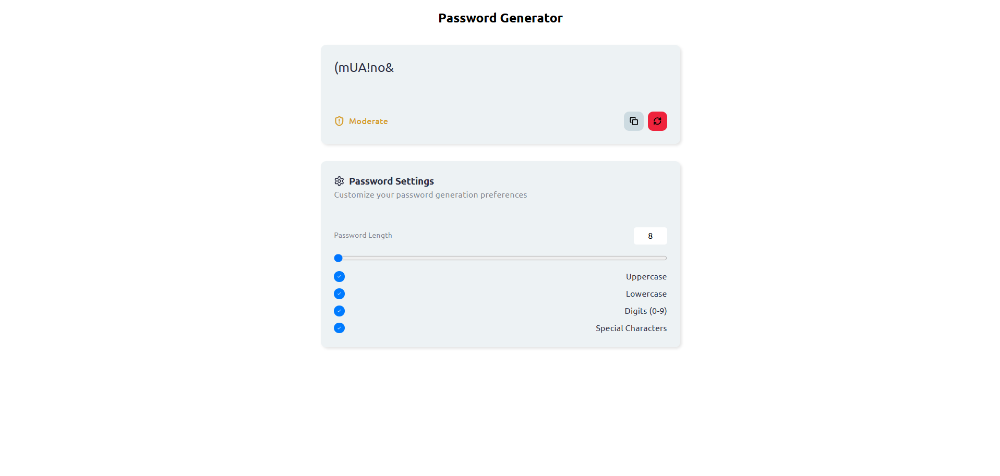

# 🔐 Password Generation App - Learning Project

A simple, secure tool to generate strong, randomized passwords with customizable length and character options.

## ✨ Features
- Adjustable password length (8-32 characters)
- Character type selection (uppercase, lowercase, numbers, symbols)
- Password strength indicator
- Copy to clipboard

## 🎯 Learning Goals

This project helped develop skills in:

- Understanding Vue's reactive data system
- Learning component structure
- Working with Vue directive (v-if, , v-model)
- Spread Operators
- Handling user input with two-way data binding
- Setting up component props and emits
- Event handling (@click)
- Clipboard API integration
- Conditional Rendering for UI states

## 🛠️ Built With
- Vue.js
- Vite
- HTML/CSS/JavaScript
- Clipboard API

## 📚 Libraries Used
- [Lucide Icon Library](https://lucide.dev/ "Lucide Icon Library")
- [ChanceJS](https://chancejs.com/ "ChanceJS")

## 📦 Installation

### Prerequisites
- [Node.js](https://nodejs.org/) (version 16 or higher)
- npm or yarn package manager
